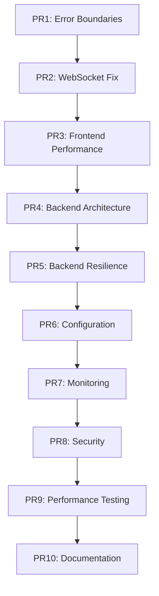

# Making the Codebase Robust - PR Breakdown

## Overview

This document details the systematic approach to addressing AI-generated code antipatterns and making the codebase production-ready. Each PR is designed to be atomic, testable, and incrementally improve the system's robustness.

---

## PR1: Frontend Error Boundaries & Recovery

### Objective
Prevent application crashes by adding comprehensive error boundaries and recovery mechanisms.

### Scope
- Add error boundaries to all routes
- Create fallback UI components
- Implement error recovery strategies
- Add error logging infrastructure

### Implementation Steps

1. **Create Error Boundary Infrastructure**
   ```
   src/core/errors/
   ├── ErrorBoundary.tsx
   ├── ErrorBoundary.types.ts
   ├── ErrorFallback.tsx
   ├── ErrorFallback.module.css
   ├── ErrorLogger.ts
   └── index.ts
   ```

2. **Add Route-Level Error Boundaries**
   - Wrap each lazy-loaded feature in error boundary
   - Create specific error messages per feature
   - Add recovery actions (retry, reload, go home)

3. **Create Global Error Handler**
   - Window.onerror handler
   - Unhandled promise rejection handler
   - Error reporting service integration point

4. **Add Error Recovery Mechanisms**
   - Retry buttons for recoverable errors
   - State reset functionality
   - Navigation fallbacks

5. **Testing**
   - Test error boundary triggering
   - Test recovery mechanisms
   - Test error logging

### Success Criteria
- [ ] No white screen of death on component errors
- [ ] All routes have error boundaries
- [ ] Errors are logged with context
- [ ] Recovery actions work correctly

### Integration with Existing Linting Infrastructure

**Add to ESLint Configuration:**
```javascript
// Add to eslint.config.js as a custom rule
{
  'react/require-error-boundary': 'error',  // Use existing plugin if available
  'custom/route-error-boundary': {
    // Custom rule for route components
    files: ['src/features/*/components/**/index.tsx'],
    rules: {
      'must-export-with-error-boundary': 'error'
    }
  }
}
```

**Add to Design Linter (.design-lint.yml):**
```yaml
# Add these rules to existing .design-lint.yml
frontend_robustness:
  error_boundaries:
    pattern: "export.*default.*(?!ErrorBoundary)"
    paths: ["src/features/*/components/**/index.tsx"]
    severity: error
    message: "Route components must be wrapped in ErrorBoundary"

  error_recovery:
    require: ["retry", "fallback", "onError"]
    in_files: ["**/ErrorBoundary.tsx"]
    message: "Error boundaries must implement recovery mechanisms"
```

**Update Makefile.lint:**
```makefile
# Add to existing lint-all target
lint-error-boundaries:
	@echo "Checking error boundary coverage..."
	@docker exec -it frontend npm run lint:custom -- --rule error-boundaries
	@python tools/design_linter.py --config .design-lint.yml --check frontend_robustness
```

---

## PR2: Fix WebSocket Architecture

### Objective
Replace the singleton antipattern with proper React integration and add connection resilience.

### Scope
- Remove WebSocket singleton
- Implement WebSocket context/provider
- Add reconnection logic
- Add connection state management

### Implementation Steps

1. **Create WebSocket Provider**
   ```
   src/services/websocket/
   ├── WebSocketProvider.tsx
   ├── WebSocketContext.tsx
   ├── useWebSocket.ts
   ├── WebSocketService.ts
   ├── types.ts
   └── index.ts
   ```

2. **Implement Connection Resilience**
   - Exponential backoff for reconnection
   - Connection state tracking
   - Queue messages during disconnect
   - Automatic reconnection

3. **Replace Singleton Usage**
   - Update DemoTab to use context
   - Remove singleton file
   - Update all WebSocket consumers

4. **Add Connection Management**
   - Connection health checks
   - Heartbeat/ping-pong
   - Graceful shutdown

5. **Testing**
   - Test connection lifecycle
   - Test reconnection scenarios
   - Test message queuing

### Success Criteria
- [ ] No module-level singletons
- [ ] WebSocket reconnects automatically
- [ ] Connection state properly managed
- [ ] Works with React StrictMode

### Integration with Existing Linting Infrastructure

**Add to ESLint Configuration:**
```javascript
// eslint.config.js - Add to existing rules
{
  'no-restricted-syntax': [
    'error',
    {
      selector: "VariableDeclaration[kind='let'] > VariableDeclarator[id.name='instance'][init=null]",
      message: 'Module-level singletons break React lifecycle. Use Context or hooks instead.'
    }
  ],
  'no-restricted-patterns': [
    'error',
    {
      pattern: 'let.*instance.*=.*null',
      message: 'Singleton pattern detected. Use React Context for shared state.'
    }
  ]
}
```

**Add to Design Linter (.design-lint.yml):**
```yaml
# Add to existing .design-lint.yml
react_patterns:
  no_singletons:
    pattern: "let\\s+instance\\s*[:=]\\s*(null|undefined)"
    severity: error
    message: "Module singletons violate React lifecycle"

  websocket_context:
    require_in_files: ["**/websocket/**/*.tsx"]
    require: ["createContext", "Provider", "useContext"]
    message: "WebSocket must use React Context pattern"

  connection_resilience:
    require_in_files: ["**/WebSocketService.ts"]
    require: ["reconnect", "backoff", "retry"]
    message: "WebSocket must implement reconnection logic"
```

**Update Makefile.lint:**
```makefile
# Add new target integrated with existing lint-all
lint-singletons:
	@echo "Checking for singleton antipatterns..."
	@docker exec -it frontend npm run lint -- --rule no-restricted-syntax
	@python tools/design_linter.py --config .design-lint.yml --check react_patterns
```

---

## PR3: Frontend Performance Optimization

### Objective
Fix performance issues including polling loops, memory leaks, and inefficient data handling.

### Scope
- Replace polling with event-driven updates
- Optimize oscilloscope data buffering
- Add performance monitoring
- Fix memory leaks

### Implementation Steps

1. **Eliminate Polling Loops**
   - Replace setInterval polling with events
   - Use WebSocket events for state updates
   - Implement proper event listeners

2. **Optimize Data Handling**
   ```typescript
   // Replace inefficient array operations
   class CircularBuffer {
     constructor(maxSize: number)
     push(items: number[])
     getView(): Float32Array
   }
   ```

3. **Add Performance Monitoring**
   ```
   src/core/performance/
   ├── PerformanceMonitor.ts
   ├── usePerformanceMetrics.ts
   ├── PerformanceContext.tsx
   └── index.ts
   ```

4. **Fix Memory Leaks**
   - Add proper cleanup in useEffect
   - Clear timers and intervals
   - Remove event listeners
   - Cancel pending requests

5. **Optimize Rendering**
   - Add memo to expensive computations
   - Use requestAnimationFrame for canvas
   - Implement virtual scrolling where needed

### Success Criteria
- [ ] No polling loops in codebase
- [ ] Smooth 60fps oscilloscope rendering
- [ ] No memory leaks detected
- [ ] Performance metrics available

### Integration with Existing Linting Infrastructure

**Add to ESLint Configuration:**
```javascript
// eslint.config.js - Performance rules
{
  'no-restricted-syntax': [
    'error',
    {
      selector: "CallExpression[callee.name='setInterval']",
      message: 'Polling loops detected. Use event-driven updates instead.'
    }
  ],
  'react-hooks/exhaustive-deps': 'error',
  'react-hooks/rules-of-hooks': 'error',
  'custom/require-cleanup': {
    // Ensure useEffect has cleanup
    files: ['**/*.tsx'],
    message: 'useEffect must return cleanup function'
  }
}
```

**Add to Design Linter (.design-lint.yml):**
```yaml
performance_patterns:
  no_polling:
    pattern: "setInterval\\(.*,\\s*\\d{2,4}\\)"
    severity: error
    message: "Polling loops waste resources. Use events."

  require_cleanup:
    in_files: ["**/*.tsx"]
    pattern: "useEffect\\(\\(\\)\\s*=>\\s*\\{[^}]*\\}\\s*,"
    must_contain: "return\\s*\\(\\)\\s*=>"
    message: "useEffect must have cleanup function"

  optimize_arrays:
    pattern: "\\[\\.\\.\\..*\\]\\.slice\\("
    severity: warning
    message: "Inefficient array operations. Use circular buffer."
```

**Update Makefile.lint:**
```makefile
lint-performance:
	@echo "Checking performance antipatterns..."
	@docker exec -it frontend npm run lint -- --rule react-hooks
	@python tools/design_linter.py --config .design-lint.yml --check performance_patterns
```

---

## PR4: Backend Service Layer Architecture

### Objective
Transform monolithic backend into properly layered architecture with separation of concerns.

### Scope
- Create service layer
- Add repository pattern
- Implement dependency injection
- Refactor oscilloscope module

### Implementation Steps

1. **Create Service Layer Structure**
   ```
   app/
   ├── services/
   │   ├── __init__.py
   │   ├── base.py
   │   ├── oscilloscope_service.py
   │   └── waveform_service.py
   ├── repositories/
   │   ├── __init__.py
   │   └── base.py
   └── core/
       ├── dependencies.py
       └── containers.py
   ```

2. **Extract Business Logic**
   - Move waveform generation to service
   - Extract WebSocket handling to service
   - Create command processor service

3. **Implement Dependency Injection**
   ```python
   from dependency_injector import containers, providers

   class Container(containers.DeclarativeContainer):
       config = providers.Configuration()
       oscilloscope_service = providers.Singleton(
           OscilloscopeService,
           config=config.oscilloscope
       )
   ```

4. **Refactor API Endpoints**
   - Use dependency injection
   - Delegate to services
   - Keep endpoints thin

5. **Testing**
   - Unit test services in isolation
   - Test dependency injection
   - Integration tests for full stack

### Success Criteria
- [ ] Clear separation of concerns
- [ ] Services are unit testable
- [ ] No business logic in endpoints
- [ ] Dependency injection working

### Integration with Existing Linting Infrastructure

**Add to Pylint Configuration:**
```python
# .pylintrc - Add to existing
[DESIGN]
max-line-length=100
max-module-lines=200  # Enforce modular files
max-classes-per-module=3
```

**Add to Design Linter (.design-lint.yml):**
```yaml
backend_architecture:
  service_layer:
    require_in_files: ["app/services/*.py"]
    require: ["class.*Service", "async def"]
    message: "Services must be classes with async methods"

  no_monolithic_modules:
    max_lines: 200
    paths: ["app/**/*.py"]
    message: "Files over 200 lines should be split"

  dependency_injection:
    require_in_files: ["app/api/**/*.py"]
    require: ["Depends", "get_service"]
    message: "Use dependency injection in endpoints"
```

**Update Makefile.lint:**
```makefile
lint-architecture:
	@echo "Checking architectural patterns..."
	@docker exec -it backend pylint app/ --max-module-lines=200
	@python tools/design_linter.py --config .design-lint.yml --check backend_architecture
```

---

## PR5: Backend Error Handling & Resilience

### Objective
Implement structured error handling, retry logic, and resilience patterns.

### Scope
- Custom exception hierarchy
- Global error handlers
- Retry logic with circuit breakers
- Structured error responses

### Implementation Steps

1. **Create Exception Hierarchy**
   ```python
   app/core/exceptions.py

   class AppException(Exception):
       """Base exception"""

   class ValidationError(AppException):
       """Input validation failed"""

   class ServiceError(AppException):
       """Service layer error"""

   class WebSocketError(AppException):
       """WebSocket specific error"""
   ```

2. **Add Global Exception Handlers**
   ```python
   @app.exception_handler(AppException)
   async def app_exception_handler(request, exc):
       return JSONResponse(
           status_code=exc.status_code,
           content={
               "error": exc.error_code,
               "message": str(exc),
               "details": exc.details
           }
       )
   ```

3. **Implement Retry Logic**
   ```python
   from tenacity import retry, stop_after_attempt, wait_exponential

   @retry(
       stop=stop_after_attempt(3),
       wait=wait_exponential(multiplier=1, min=4, max=10)
   )
   async def resilient_operation():
       """Operation with automatic retry"""
   ```

4. **Add Circuit Breaker**
   ```python
   from pybreaker import CircuitBreaker

   db_breaker = CircuitBreaker(fail_max=5, reset_timeout=60)

   @db_breaker
   async def database_operation():
       """Protected database operation"""
   ```

5. **Testing**
   - Test exception handling paths
   - Test retry scenarios
   - Test circuit breaker behavior

### Success Criteria
- [ ] No broad exception catching
- [ ] Structured error responses
- [ ] Retry logic for external calls
- [ ] Circuit breaker prevents cascading failures

### Integration with Existing Linting Infrastructure

**Add to Flake8 Configuration:**
```ini
# .flake8 - Add to existing
[flake8]
per-file-ignores =
    # Disallow broad exceptions
    *.py: B902
extend-select = B902  # Require specific exception types
```

**Add to Design Linter (.design-lint.yml):**
```yaml
error_handling:
  no_broad_exceptions:
    pattern: "except\\s+(Exception|BaseException):"
    severity: error
    message: "Use specific exception types"

  require_retry:
    require_in_files: ["app/services/**/*.py"]
    pattern: "async\\s+def.*external"
    must_contain: "@retry"
    message: "External calls must have retry logic"

  structured_errors:
    require_in_files: ["app/core/exceptions.py"]
    require: ["class.*Error.*Exception", "status_code", "error_code"]
    message: "Exceptions must be structured with codes"
```

**Update Makefile.lint:**
```makefile
lint-error-handling:
	@echo "Checking error handling patterns..."
	@docker exec -it backend flake8 app/ --select=B902
	@python tools/design_linter.py --config .design-lint.yml --check error_handling
```

---

## PR6: Configuration Management

### Objective
Replace hardcoded values with environment-based configuration management.

### Scope
- Environment variable loading
- Configuration validation
- Secrets management
- Feature flags

### Implementation Steps

1. **Frontend Configuration**
   ```typescript
   src/core/config/
   ├── config.ts
   ├── env.d.ts
   ├── validateConfig.ts
   └── index.ts
   ```

2. **Backend Configuration**
   ```python
   app/core/config.py

   from pydantic import BaseSettings

   class Settings(BaseSettings):
       app_name: str = "Durable Code"
       environment: str
       websocket_port: int
       sample_rate: int

       class Config:
           env_file = ".env"
   ```

3. **Add Configuration Validation**
   - Validate required variables exist
   - Type checking for values
   - Range validation
   - Fail fast on invalid config

4. **Implement Feature Flags**
   ```typescript
   interface FeatureFlags {
       enableNewOscilloscope: boolean
       enablePerformanceMonitoring: boolean
   }
   ```

5. **Testing**
   - Test configuration loading
   - Test validation rules
   - Test feature flag toggling

### Success Criteria
- [ ] No hardcoded configuration values
- [ ] Environment-based configuration
- [ ] Configuration validation on startup
- [ ] Feature flags working

### Integration with Existing Linting Infrastructure

**Add to ESLint/Pylint:**
```javascript
// ESLint - no hardcoded values
{
  'no-magic-numbers': ['error', {
    ignore: [0, 1, -1],
    enforceConst: true
  }]
}
```

**Add to Design Linter (.design-lint.yml):**
```yaml
configuration_management:
  no_hardcoded_ports:
    pattern: "(PORT|HOST|URL)\\s*=\\s*[\"']?\\d+"
    severity: error
    message: "Use environment variables for configuration"

  no_hardcoded_urls:
    pattern: "(http|ws)://[^$]"
    exclude: ["**/tests/**", "**/*.test.ts"]
    severity: error
    message: "URLs must come from configuration"

  require_config_validation:
    require_in_files: ["**/config.*"]
    require: ["validate", "assert", "throw"]
    message: "Configuration must be validated"
```

**Update Makefile.lint:**
```makefile
lint-config:
	@echo "Checking configuration patterns..."
	@docker exec -it frontend npm run lint -- --rule no-magic-numbers
	@python tools/design_linter.py --config .design-lint.yml --check configuration_management
```

---

## PR7: Monitoring & Observability

### Objective
Add comprehensive monitoring, logging, and observability infrastructure.

### Scope
- Structured logging
- Distributed tracing
- Metrics collection
- Health checks

### Implementation Steps

1. **Structured Logging**
   ```python
   import structlog

   logger = structlog.get_logger()
   logger.info(
       "websocket_connected",
       connection_id=connection_id,
       client_ip=client_ip
   )
   ```

2. **Add OpenTelemetry**
   ```python
   from opentelemetry import trace
   from opentelemetry.instrumentation.fastapi import FastAPIInstrumentor

   FastAPIInstrumentor.instrument_app(app)
   ```

3. **Metrics Collection**
   ```python
   from prometheus_client import Counter, Histogram

   websocket_connections = Counter(
       'websocket_connections_total',
       'Total WebSocket connections'
   )

   request_duration = Histogram(
       'request_duration_seconds',
       'Request duration'
   )
   ```

4. **Health Checks**
   ```python
   @app.get("/health/live")
   async def liveness():
       return {"status": "alive"}

   @app.get("/health/ready")
   async def readiness():
       checks = await run_readiness_checks()
       return {"status": "ready", "checks": checks}
   ```

5. **Testing**
   - Test logging output
   - Test trace generation
   - Test metrics collection
   - Test health endpoints

### Success Criteria
- [ ] Structured logs with correlation IDs
- [ ] Distributed tracing working
- [ ] Metrics exposed for Prometheus
- [ ] Health checks implemented

### Integration with Existing Linting Infrastructure

**Add to Design Linter (.design-lint.yml):**
```yaml
observability:
  structured_logging:
    pattern: "(print\\(|console\\.log)"
    severity: error
    message: "Use structured logging instead of print/console.log"

  require_correlation_id:
    require_in_files: ["app/middleware/logging.py"]
    require: ["correlation_id", "request_id"]
    message: "Logs must include correlation ID"

  health_checks:
    require_in_files: ["app/api/health.py"]
    require: ["liveness", "readiness"]
    message: "Must implement liveness and readiness probes"
```

**Update Makefile.lint:**
```makefile
lint-observability:
	@echo "Checking observability patterns..."
	@python tools/design_linter.py --config .design-lint.yml --check observability
	@grep -r "console.log\|print(" --exclude-dir=node_modules --exclude-dir=.git . && echo "❌ Found print/console.log" || echo "✅ No print statements"
```

---

## PR8: Security Hardening

### Objective
Implement security best practices and protect against common vulnerabilities.

### Scope
- Input validation improvements
- Rate limiting
- Security headers
- CORS refinement

### Implementation Steps

1. **Enhanced Input Validation**
   ```python
   from pydantic import validator, constr

   class StrictInput(BaseModel):
       text: constr(min_length=1, max_length=1000)

       @validator('text')
       def sanitize_input(cls, v):
           # Remove dangerous characters
           return sanitize(v)
   ```

2. **Add Rate Limiting**
   ```python
   from slowapi import Limiter

   limiter = Limiter(
       key_func=get_remote_address,
       default_limits=["100 per minute"]
   )

   @app.get("/api/data")
   @limiter.limit("10 per minute")
   async def get_data():
       pass
   ```

3. **Security Headers**
   ```python
   from secure import SecureHeaders

   secure_headers = SecureHeaders()

   @app.middleware("http")
   async def set_secure_headers(request, call_next):
       response = await call_next(request)
       secure_headers.framework.fastapi(response)
       return response
   ```

4. **CORS Refinement**
   ```python
   app.add_middleware(
       CORSMiddleware,
       allow_origins=settings.allowed_origins,
       allow_credentials=False,
       allow_methods=["GET", "POST"],
       allow_headers=["Content-Type"],
       max_age=3600
   )
   ```

5. **Testing**
   - Test input validation
   - Test rate limiting
   - Test security headers
   - Test CORS configuration

### Success Criteria
- [ ] Input validation comprehensive
- [ ] Rate limiting prevents abuse
- [ ] Security headers present
- [ ] CORS properly configured

### Integration with Existing Linting Infrastructure

**Add to Bandit Configuration:**
```yaml
# .bandit - Security checks
skips: []
tests: [B201, B301, B302, B303, B304, B305, B306]
```

**Add to Design Linter (.design-lint.yml):**
```yaml
security_patterns:
  input_validation:
    require_in_files: ["app/api/**/*.py"]
    require: ["@validator", "Field", "constr"]
    message: "All inputs must be validated with Pydantic"

  rate_limiting:
    require_in_files: ["app/api/**/*.py"]
    require: ["@limiter", "RateLimiter"]
    message: "Endpoints must have rate limiting"

  security_headers:
    require_in_files: ["app/middleware/security.py"]
    require: ["X-Content-Type-Options", "X-Frame-Options", "CSP"]
    message: "Security headers must be set"
```

**Update Makefile.lint:**
```makefile
lint-security:
	@echo "Running security checks..."
	@docker exec -it backend bandit -r app/
	@docker exec -it backend safety check
	@python tools/design_linter.py --config .design-lint.yml --check security_patterns
```

---

## PR9: Performance Testing & Benchmarks

### Objective
Establish performance baselines and ensure system meets performance requirements.

### Scope
- Load testing setup
- Performance benchmarks
- Performance regression tests
- Performance monitoring

### Implementation Steps

1. **Load Testing Setup**
   ```yaml
   # locust/locustfile.py
   from locust import HttpUser, task, between

   class WebsiteUser(HttpUser):
       wait_time = between(1, 3)

       @task
       def oscilloscope_stream(self):
           with self.client.websocket("/ws/stream") as ws:
               ws.send_json({"command": "start"})
   ```

2. **Performance Benchmarks**
   ```python
   # tests/benchmarks/test_performance.py
   import pytest

   @pytest.mark.benchmark
   def test_waveform_generation(benchmark):
       result = benchmark(generate_waveform, 1000)
       assert len(result) == 1000
   ```

3. **Frontend Performance Tests**
   ```typescript
   // tests/performance/rendering.test.ts
   test('oscilloscope renders at 60fps', async () => {
     const fps = await measureFPS(() => {
       renderOscilloscope(data)
     })
     expect(fps).toBeGreaterThan(55)
   })
   ```

4. **Performance Monitoring**
   - Add performance budgets
   - Monitor bundle size
   - Track render performance
   - API response times

5. **Testing**
   - Run load tests
   - Execute benchmarks
   - Check performance budgets
   - Verify monitoring

### Success Criteria
- [ ] Load tests passing
- [ ] Performance benchmarks established
- [ ] Bundle size under budget
- [ ] 60fps rendering maintained

### Integration with Existing Linting Infrastructure

**Add Bundle Size Check:**
```json
// package.json scripts
{
  "size-limit": [
    {
      "path": "dist/**/*.js",
      "limit": "200 KB"
    }
  ]
}
```

**Add to Design Linter (.design-lint.yml):**
```yaml
performance_benchmarks:
  require_benchmarks:
    require_in_files: ["tests/benchmarks/**/*.py"]
    require: ["@pytest.mark.benchmark", "assert.*<"]
    message: "Benchmarks must have assertions"

  frontend_performance:
    require_in_files: ["tests/performance/**/*.test.ts"]
    require: ["measureFPS", "expect.*toBeGreaterThan"]
    message: "Performance tests must measure FPS"
```

**Update Makefile.lint:**
```makefile
lint-performance-benchmarks:
	@echo "Checking performance benchmarks..."
	@docker exec -it frontend npm run size-limit
	@python tools/design_linter.py --config .design-lint.yml --check performance_benchmarks
```

---

## PR10: Documentation & AI Templates

### Objective
Create comprehensive documentation and templates to prevent AI from recreating antipatterns.

### Scope
- AI-safe component templates
- Service templates with best practices
- Architecture documentation
- Contributing guidelines

### Implementation Steps

1. **Component Templates**
   ```typescript
   // templates/Component.template.tsx
   import React from 'react'
   import { ErrorBoundary } from '@/core/errors'

   export const ComponentTemplate: React.FC = () => {
     // ALWAYS add error boundary
     return (
       <ErrorBoundary>
         {/* Component content */}
       </ErrorBoundary>
     )
   }
   ```

2. **Service Templates**
   ```python
   # templates/service_template.py
   from typing import Optional
   from app.core.exceptions import ServiceError
   from tenacity import retry

   class ServiceTemplate:
       """ALWAYS use retry logic for external calls"""

       @retry(stop=stop_after_attempt(3))
       async def external_operation(self):
           """Template for resilient operations"""
   ```

3. **Architecture Documentation**
   ```
   docs/
   ├── architecture/
   │   ├── README.md
   │   ├── frontend.md
   │   ├── backend.md
   │   └── decisions/
   ├── contributing/
   │   ├── ai-guidelines.md
   │   └── antipatterns.md
   └── templates/
   ```

4. **AI Guidelines**
   - List of banned patterns
   - Required patterns checklist
   - Code review criteria
   - Testing requirements

5. **Testing**
   - Validate templates compile
   - Test template usage
   - Documentation review

### Success Criteria
- [ ] Templates prevent common mistakes
- [ ] Documentation comprehensive
- [ ] AI guidelines clear
- [ ] Contributing guide complete

### Integration with Existing Linting Infrastructure

**Add Template Validation:**
```yaml
# .design-lint.yml - Template enforcement
template_compliance:
  component_template:
    require_in_files: ["templates/**/*.template.tsx"]
    require: ["ErrorBoundary", "React.memo", "cleanup"]
    message: "Templates must include error handling and optimization"

  service_template:
    require_in_files: ["templates/**/*.template.py"]
    require: ["@retry", "async def", "try.*except"]
    message: "Service templates must include resilience patterns"

  ai_guidelines:
    require_in_files: ["docs/ai-guidelines.md"]
    require: ["NEVER", "ALWAYS", "antipattern"]
    message: "AI guidelines must be explicit"
```

**Update Makefile.lint:**
```makefile
lint-templates:
	@echo "Validating templates and documentation..."
	@python tools/design_linter.py --config .design-lint.yml --check template_compliance
	@test -f docs/ai-guidelines.md || echo "❌ Missing AI guidelines"
```

**Master Lint Target:**
```makefile
# Add to main Makefile.lint
lint-robust: lint-error-boundaries lint-singletons lint-performance \
             lint-architecture lint-error-handling lint-config \
             lint-observability lint-security lint-performance-benchmarks \
             lint-templates
	@echo "✅ All robustness checks passed!"

# Integrate with existing lint-all
lint-all: lint-python lint-javascript lint-css lint-html lint-robust
```

---

## Implementation Order & Dependencies



## Risk Mitigation

Each PR includes:
- Backward compatibility maintenance
- Feature flags for gradual rollout
- Comprehensive testing
- Rollback procedures
- Documentation updates

## Success Metrics

After all PRs:
- Zero unhandled errors in production
- < 100ms P95 API response time
- 60fps UI rendering
- Zero security vulnerabilities
- 80%+ test coverage
- Complete observability
